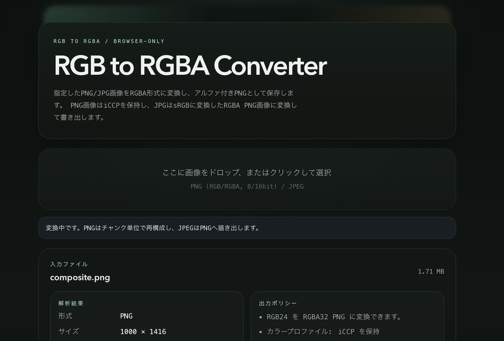

# rgb2rgba

ブラウザ上で PNG / JPEG を読み込み RGBA の PNG として保存する、シンプルな変換ツールです。



## できること

- RGB24 PNG を RGBA32 PNG に変換
- RGB48 PNG を RGBA64 PNG に変換
- JPEG を不透明アルファ付きの RGBA PNG に変換
- 変換前に形式、サイズ、ビット深度、アルファ有無、ICC / iCCP 有無を確認

## 特徴

- 変換はブラウザ内だけで完結し、画像を外部にアップロードしません
- RGB の PNG は canvas を経由せずに再構成するため、8bit / 16bit の bit depth を維持します
- PNG に埋め込まれた `iCCP` は保持します
- JPEG はブラウザでデコードした結果を PNG に書き出します

## 対応形式

- 入力: `PNG`, `JPEG`
- 出力: `PNG`

次のケースは変換対象外です。

- すでに RGBA の PNG
- grayscale / palette 系 PNG
- Adam7 インターレース PNG

## 動かし方

```bash
pnpm install
pnpm dev
```

起動後、表示された URL をブラウザで開いてください。画像をドロップするか、クリックして選択すると解析結果が表示されます。変換ボタンを押すと `*_rgba.png` という名前で保存されます。

## 補足

- 複数ファイルをドロップした場合は先頭の 1 件だけを処理します
- JPEG の ICC プロファイルは再埋め込みしません

## ライセンス

[MIT](LICENSE)
